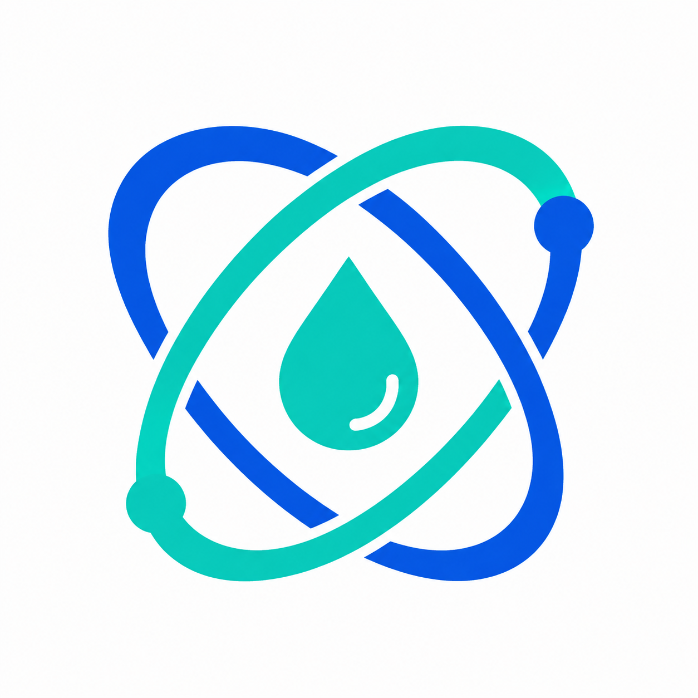

# Gemini-S1 LabTwin：实验台 AI 终端

面向实验台的 AI 硬件作品，基于 Gemini-S1 / Allwinner R528 / openvela 与 AI Agent，把实验步骤、并行倒计时、观察记录和温湿度事件汇入同一板端事实源，并提供局域网网页工作台。赛道：AI 硬件产品创新，队伍 117「duiduidui」。



## 主要能力

- 板端实验流程状态、最多 8 个活动实验、多计时器、观察与报告；磁盘历史独立于有限内存槽位，事件提交与恢复保留旧数据兼容。
- 网页 Agent 独立会话、历史恢复与请求去重；任务编辑、月/周/列表日历与历史筛选；完成/取消/删除经可信执行层确认，删除按板端认证模式校验。
- 温湿度 5 分钟聚合，保留约一月，较旧数据按小时压缩；未同步时间明确标为未知，不虚构发生时间。
- 网页板端麦克风录音、历史列表、原生 WAV 播放/拖动/删除；16 kHz / 16-bit / 单声道，单条上限 1 小时、总配额 120 MiB，录音时暂停唤醒。
- 板端 LVGL 实验/语音页面、按键对话路径、ASR/TTS 配置及统一可信 TLS 验证。离线唤醒属实验性能力：公开版仅含未训练占位模型，不带私人录音或模型。

功能实现不等于全部验收完成。真实云 Agent/ASR/TTS、一小时录音、板载声音输出及公开版实板验收仍有未验证项，详见[验证记录](labtwin/docs/VALIDATION.md)。本仓仅发布源码，不发布私有调试固件、网络/API 凭据或设备数据；公开默认不启用免密管理员和预设 Wi-Fi。

## 源码布局

```text
labtwin/overlay/packages/ai_agent/    Agent、实验核心、录音、网关、安全、测试
labtwin/overlay/tools/labtwin-dashboard/  可维护 React Portal、扩展、资源、组件测试
labtwin/overlay/vendor/allwinnertech/    Gemini-S1 UI、BSP、音频/网络、配置、CA
labtwin/overlay/apps/                   NTP/WAPI/TFLM/LVGL 及回归测试
labtwin/overlay/frameworks/system/utils/ KVDB 持久化
labtwin/overlay/vendor/openvela/        Goldfish 业务模拟配置
labtwin/manifests/upstream.xml       固定 247 个上游项目 revision
labtwin/SOURCE_MANIFEST.json         来源、公开调整、逐文件 SHA 与模式
labtwin/tools/                      校验、基线安全应用、Portal ROMFS 同步
labtwin/docs/                       构建、验收边界、许可证与模块说明
app/ board/ quickapp/ logs/          原比赛模板保留；不是本作品入口
```

必要的跨仓修改随 overlay 提交，上游完整源码由固定 manifest 获取；不带私有 Git 历史。公开重建从维护源生成 ROMFS，不手工修改带哈希的 bundle。

## 重建与使用

完整环境、逐步命令与安全默认见[构建指南](labtwin/docs/BUILD.md)。拉取固定上游基线并校验/应用 overlay，再运行 Portal 测试、生产构建与 ROMFS 同步，最后编译：

```bash
./build.sh vendor/allwinnertech/boards/r528/r528s3-gemini-s1/configs/nsh_minidisplay -j4
```

Portal 使用 `npm ci`、`npm run test:unit`、`npm run lint`、`npm test`、`npm run build:board`。C 主机测试涵盖事务故障/重放、Agent 确认与聊天账本、录音发布与 Range、TLS 和 NTP UDP。模拟器不能代替硬件验收。

## AI Coding 与提交说明

使用 Codex 辅助需求拆解、实现、跨仓集成、回归、ADB/网页故障定位和文档维护；采用 Task ID、隔离分支及单一集成责任人，校验“维护源 → ROMFS → IMG → 实体页面”避免多对话修改遗漏。

`logs/` 仍是官方模板示例，不冒充真实开发日志。私人原对话含凭据、录音及设备数据，未直接上传；比赛日志需另做脱敏导出与审核。本次上传到作者自己的公开仓，不表示组委会已接收或竞赛材料齐全。[原模板说明](labtwin/docs/CONTEST_TEMPLATE.md)保留供参考。

## 许可

新增自研 Portal、发布工具和文档采用 [Apache-2.0](LICENSE)。AI Agent 原 LICENSE/NOTICE、MimiClaw MIT、BSP 和其他第三方原许可均保留，不统一重新授权。[第三方说明](labtwin/docs/THIRD_PARTY.md)列出来源与公开范围。
