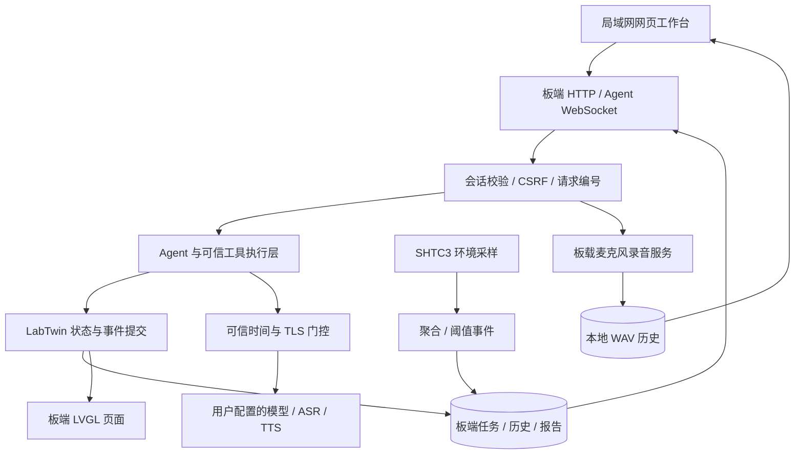

# LabTwin 项目设计与功能亮点

Task: TASK-20261003-06；Primary Module: Management Dashboard。此页解释作品价值和实现设计，验收结论以 [VALIDATION.md](VALIDATION.md) 为准。

## 解决什么问题

实验台上的任务、倒计时、观察笔记和环境变化通常分散在不同工具中。多个流程并行时，人需要不断核对“现在做到哪一步”“哪个计时已到期”“当时的环境是什么”。LabTwin 将这些信息放入 Gemini-S1 板端的结构化任务，由本地屏幕和局域网网页共同使用。

典型操作是：网页建立观察任务与计划步骤 → 板端或网页启动、计时、追加观察 → 查看温湿度事件 → 完成任务 → 在日历与详情中回查过程。文字 Agent 是另一个受控操作入口，不是独立维护任务的第二套系统。产品不连接或自动控制真实化学仪器，不替代安全 SOP、人工判断或实验室合规记录系统。

## 六个值得演示的亮点

### 1. 同一个实验事实源，两个交互界面

网页负责更方便的输入、排期和历史检索；板端 LVGL 页面负责现场状态与交互。数据保存在板端，关闭浏览器不等于丢掉实验。断线后页面先等待真实数据，不显示虚构示例任务。手机和电脑都可在同一受控局域网打开管理台。

### 2. Agent 有工具，也有明确执行边界

网页与板端语音复用 Agent 能力和实验工具，但网页聊天上下文独立。网页高影响实验动作进入待确认队列：用户看清操作摘要后再确认；删除还要求完整实验编号，公开密码模式额外校验管理员密码。

确认由程序的可信执行层负责，绑定身份、参数与事件序号，有时限、一次性消费和执行结果账本。重试、实验状态变化和过期请求不能靠模型一句“已完成”绕过。真实云模型调用仍需有效配置与专项验收；[截图中的 `/time`](SCREENSHOTS.md) 是本地命令，不是模型效果证据。

### 3. 从计划走到历史，而不是只有当前任务卡

任务包含名称、说明、计划起止和步骤；READY 状态可修改，开始后锁定这些结构字段，只允许受控状态流转、计时与追加观察。日历提供月、周、列表视图，用计划时间安排未启动任务，用实际时间回看运行和历史任务。

最多 8 个运行/暂停实验；长期历史来自磁盘索引，不受原先 16 个内存缓存槽限制。删除是明确管理操作，历史不会为了腾出缓存而自动丢弃。

### 4. 温湿度不是装饰性数字

真实 SHTC3 采样进入板端环境存储，按 5 分钟粒度聚合，较旧记录压缩到小时粒度，保留约一月。网页展示趋势、阈值及触发/清除事件，帮助解释任务期间的环境变化。

时间未同步时标明未知/不可信，不为旧事件补造发生时间。当前图集确实展示了这类标记。现场短时趋势已见实屏，但“一个月保留”是设计与测试约束，不等于已经连续运行了一个月。

### 5. 网页可以听见板卡所在位置

录音面板手动控制板载麦克风，按 16 kHz、16-bit、单声道流式生成 WAV。浏览器内可播放、暂停和拖动，历史列表显示条数、时长、大小并按最新优先排序。无需将音频上传云端，也不需要电脑麦克风权限。

录音期间暂停唤醒、结束后恢复此前状态；一次仅允许一条，单条上限 1 小时、总配额 120 MiB，容量不足拒绝新录而不是删旧文件。短录音、人声可听、回放和重启保留已有私有实板证据；音量/杂音仍可改进，一小时耐久未验收。

### 6. 可靠性细节可查、可测、可重建

实验以事件完整写入并同步为提交点；事件成功、快照失败时提示已生效/待修复，不能引导用户重复操作。录音使用 `.part`、补 WAV 头、同步、原子发布，并处理重启残留。聊天请求使用持久编号，结果不确定时不自动重做。

云请求共用可信 CA、主机名与强制 TLS 验证；时钟不可信时先拒绝发送密钥、音频和对话。公开包固定上游 revision、记录 overlay 来源与 SHA，Portal 从可维护源码构建，并通过 CI 检查。它们是工程设计和回归证据，不等于所有硬件风险已消失。

## 系统关系

图是实现结构说明，不是性能测量。云服务是可选外部依赖，本地任务、环境记录与录音不以云额度为前提。

## 交付范围

板端视觉展示见 [六张同源模拟 UI](SIMULATOR_UI.md)，实板局域网网页见 [五张真实页面](SCREENSHOTS.md)；前者仅使用 Mock，不能替代后者或新增云/硬件验收。

公开仓提供自研源码、必要跨仓 overlay、固定上游 manifest、测试、构建/演示说明和五张真实网页截图。公开默认要求管理员认证，预设网络与云凭据为空；私人训练唤醒模型不公开，只有 untrained 占位。

当前公开版没有新的完整目标 IMG/实板验收结论。离线“你好 vela”唤醒、真实云 Agent/ASR/TTS、板载扬声器输出和一小时录音不得列为全部完成。详见 [验证记录](VALIDATION.md)、[开发说明](DEVELOPMENT.md) 和 [现场演示流程](DEMO.md)。
