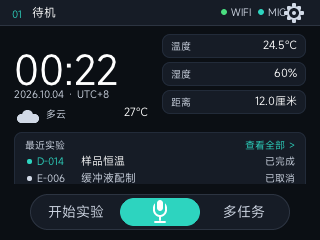
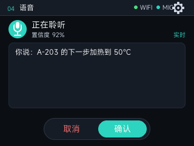
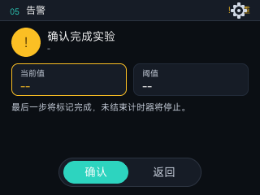
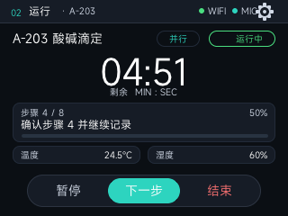
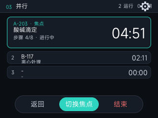
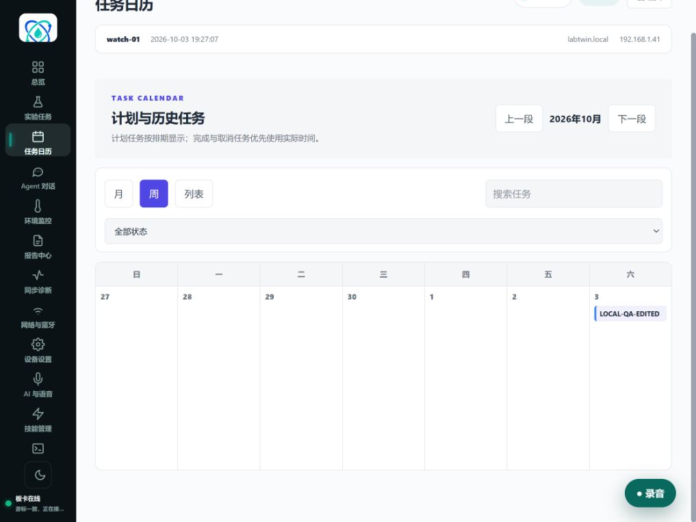
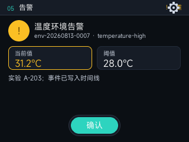
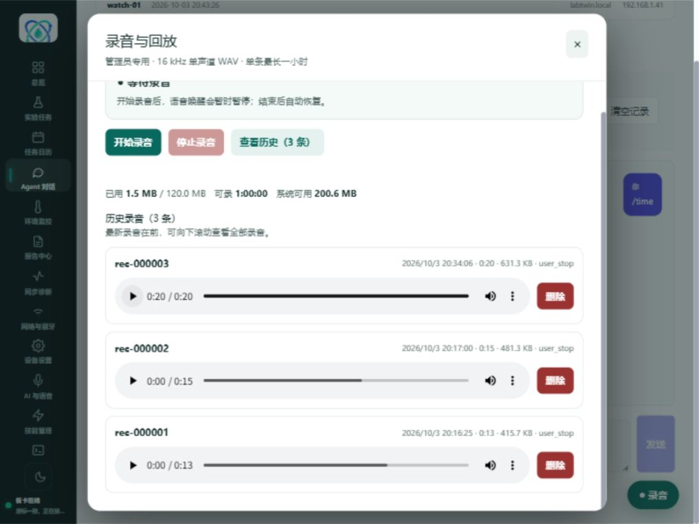
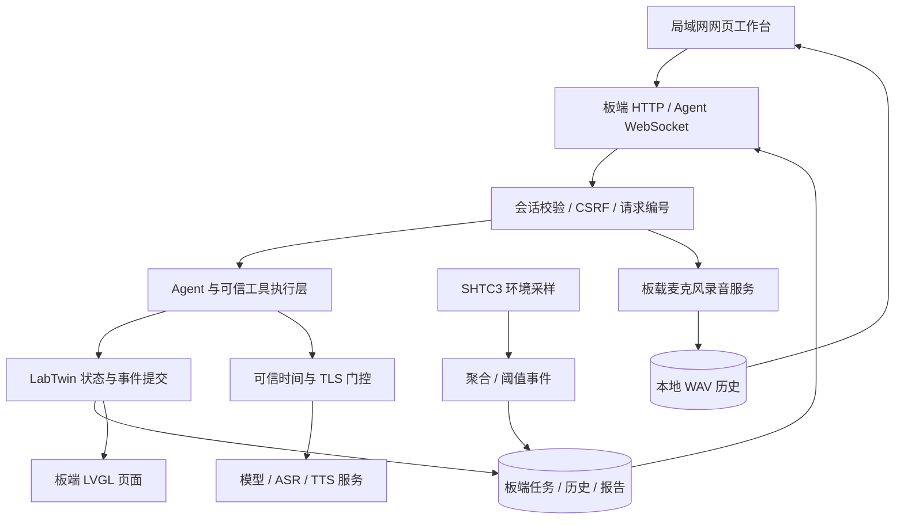

# LabTwin：让实验台上的任务、对话与记录连成一体

LabTwin 是基于 Gemini-S1 / Allwinner R528 / openvela 的实验台 AI 终端。它把现场屏幕与局域网网页工作台连接起来，将实验流程、并行计时、AI 交互、环境感知和音频记录汇入同一板端数据源。

## 从实验准备，到现场执行，再到历史回查

实验台上常常需要同时照看多个任务：核对当前步骤、等待倒计时、记下观察结果，再追查当时的环境。LabTwin 将这些操作集中在一个工作台，让现场查看更直接、任务录入更方便、过程记录更完整。

典型流程是：网页创建任务并排期 → 板端或网页启动和计时 → 追加观察、查看环境事件 → 确认完成 → 在日历和时间线中回查。Agent 是与任务系统联动的另一种交互方式，让文字对话也能进入结构化流程。

## 六个项目亮点

### 1. 现场屏幕与网页工作台，分工清晰、数据统一

板端 320×240 LVGL UI 面向现场快速查看，网页面向输入、排期和历史检索。实验数据保存在板端，手机和电脑都可通过局域网访问同一工作台；页面刷新后恢复任务与会话记录，减少重复操作。

主页将时间、环境摘要和最近实验收纳在一屏，底部提供实验、语音和多任务入口，随时了解实验台状态。

### 2. Agent 与任务联动，交互直观、操作可控

网页 Agent 提供独立的持久文字会话，并复用板端 Agent 的实验工具能力，可查询任务、创建和编辑实验、计时及追加观察。网页聊天与板端语音各自保留上下文，适配不同使用场景。

完成、取消和删除等重要动作通过可信执行层进入待确认队列，用户查看摘要后再确认。身份绑定、有效期、状态复核和执行结果账本共同约束操作，兼顾交互便利与任务管理的可控性。

 

语音页将状态与正文分区呈现，长对话在独立卡片内阅读；实验结束设置清晰的确认入口。网页“AI 与语音”提供模型及 ASR/TTS 的统一配置入口，便于管理交互服务。

### 3. 任务贯穿全生命周期，多流程并行仍有条理

任务包含名称、说明、计划时间和步骤，覆盖准备、运行、暂停、完成与取消。开始前可调整内容，开始后锁定结构字段，通过状态操作、计时和观察记录推进流程。

支持最多 8 个运行或暂停实验，多任务页突出当前焦点，其他任务保持紧凑状态。历史保存在磁盘索引中，活动任务与长期历史分开管理。

 

运行页集中显示实验名称、步骤进度与剩余时间；切换计时焦点可查看不同任务，暂停、下一步和结束分列底部。

月、周、列表三种视图兼顾排期与历史，计划时间和实际发生时间分别展示。结合状态、关键词筛选以及任务详情时间线，既能安排实验，也能回看过程。

### 4. 环境变化进入记录，让回查更有上下文

SHTC3 温湿度采样进入板端环境存储，以 5 分钟粒度聚合，较旧记录压缩到小时粒度，采用约一月的保留策略。网页呈现趋势、阈值规则及触发/清除事件，时间可信性标记帮助解释记录。

告警页并列显示关联实验、规则、当前值与阈值，提供明确的确认入口；网页趋势和历史事件用于进一步回查，使环境变化与实验流程相互关联。

### 5. 板载录音与网页回放，补充现场声音记录

网页录音面板控制板载麦克风，流式生成 16 kHz、16-bit、单声道 WAV。浏览器内支持播放、暂停和拖动进度，历史按最新优先排列，显示录制时间、时长与大小。

音频保存在板端，无需使用电脑麦克风或上传云端。单条录音时长上限设为 1 小时，总配额 120 MiB；面板显示容量与预计剩余时长。录音与唤醒通过采集所有权协调，结束后恢复此前状态，历史由管理员管理。

### 6. 过程可追溯，数据有恢复路径，源码可重建

实验修改采用事件提交与快照恢复，聊天通过持久请求编号和结果账本处理刷新与重连，录音通过临时文件、完整 WAV 头及原子发布保存结果。这些设计将恢复能力放在板端，便于持续积累实验记录。

云服务共用可信 CA、主机名校验及 TLS 时间门控。公开源码固定上游 revision，记录跨仓修改来源与逐文件 SHA；Portal 从维护源码构建，CI 执行测试、静态检查和生产构建，方便复现与持续开发。

## 系统关系

板端承担任务与记录的统一管理，网页和现场屏幕提供互补的操作入口；本地流程、环境记录与录音独立于云服务，AI 交互通过受控工具连接实验管理。

## 继续了解

- [网页 UI 展示](SCREENSHOTS.md)：任务编辑、对话、日历、环境和录音界面。
- [现场演示指南](DEMO.md)：约 5～8 分钟串联典型使用流程。
- [开发说明](DEVELOPMENT.md)：源码入口、数据流、配置与图片来源。
- [构建指南](BUILD.md)与[测试记录](VALIDATION.md)：部署步骤、回归方法与验证范围。
