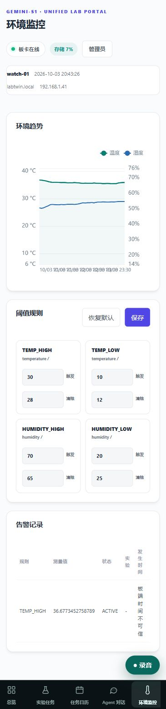
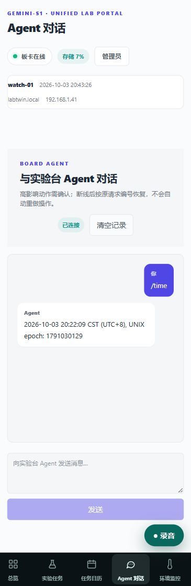
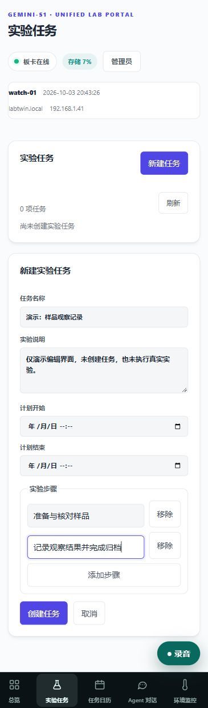

# 网页工作台 UI 展示

网页与板端共用同一套任务与记录，面向电脑和手机提供更方便的输入、排期与回查入口。板端 UI 已融入[项目介绍](PROJECT.md)，这里展示网页的五个核心页面。

## 1. 历史录音与浏览器回放

面板集中显示录音状态、容量和预计剩余时长，历史按最新优先排列。每条记录附带录制时间、时长、大小及原生播放控件，支持播放、暂停、拖动进度与确认删除，便于回听板卡所在位置的声音。

## 2. 计划与历史任务日历

月、周、列表三种视图适合不同检索习惯，日期切换和状态筛选帮助定位任务。计划排期与实际过程分别展示，点击任务即可继续查看详情与时间线。

## 3. 温湿度趋势与环境事件

温湿度曲线与阈值规则集中在同一页面，配合触发/清除事件和时间标记，为实验记录补充环境上下文。移动端纵向布局将趋势、规则和事件依次展开，方便查看。

## 4. Agent 对话与历史恢复

对话页将连接状态、聊天记录和输入区分开，页面刷新后恢复已有消息。Agent 作为任务管理的对话入口，与实验工具和受控操作确认配合使用。

## 5. 实验任务结构化编辑

表单将任务名称、说明、计划起止和步骤组织在一起，便于创建与调整实验流程。结构化输入让任务能够进入状态控制、计时、观察记录和日历回查。

## 了解更多

[项目亮点](PROJECT.md) · [现场演示](DEMO.md) · [图片来源与开发说明](DEVELOPMENT.md#界面展示资源) · [测试记录](VALIDATION.md)。
